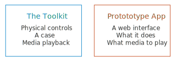
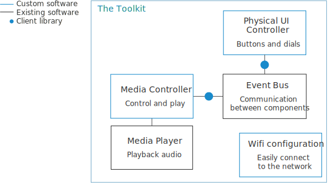

Architecture
===

The platform provides a set of useful features. But to make it do anything, you must create a prototype application. This tells the platform what your specific app will do.

Digging deeper, the toolkit is made up of components, a mixture of open source software packages and also custom software written in JavaScript running on [node.js](http://nodejs.org/).

Each component is isolated from all the others and runs independently, communicating by sending messages to the other components via a central event bus.

We've built a client library in JavaScript makes it easy to talk to the system from prototype apps, either in a web browser or from a node.js application.

Link to getting started.

The toolkit works just as well for building media prototypes that run in the cloud, or work on powerful computers. But some parts of the toolkit are specifically aimed at helping embedded linux devices such as the Raspberry Pi.

Media Controller
--

This component manages media player instances. You send the media controller commands to play audio content. This can be MP3s stored locally or internet audio streams. The media player emits events when there are changes in the system, such as the next track being played or the player being stopped. Multiple players can be created which allows you to play several streams at once (if your audio device supports it).

Physical UI Controller
--

Connects to the GPIO pins on a Raspberry Pi and emits events when a button is pressed or a dial turned. Accepts commands to change the colour of RGB LEDs.

Wifi configuration
--

On start-up, if no wifi network is joined, the Pi will create it's own wifi network, the default name is `radiodan-configuration`. Join this wifi network to configure the wifi details for the radio to join.

Event Bus
--

We use [RabbitMQ](https://www.rabbitmq.com/) as the messaging layer. There are clients for many different languages meaning that you can write prototype apps in many languages.

Link to messaging architecture docs

