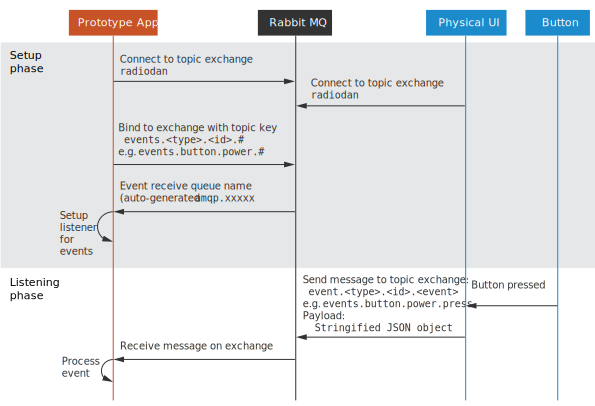
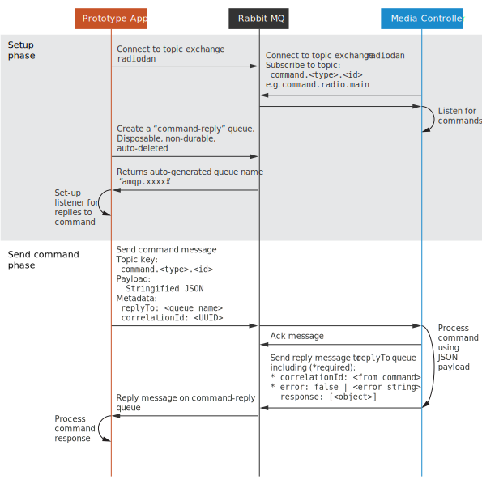

Messaging
===

The toolkit is made up of isolated components that communicate by sending messages to each other via a central event bus.

The event bus is [RabbitMQ](https://www.rabbitmq.com/) because there are clients for many different languages meaning that you can write prototype apps in many languages.

The easiest way to write apps is to use [node.js](http://nodejs.org/) and the JavaScript client library because it wraps all of the messaging calls in a programmatic API.

Link to client library API docs.

However, if you want to use another language then this document explains how the messaging system is structured.

Types of messages
---

There are two main types of messages, `events` and `commands`.

*Events* allow you to be notified when something hapens in the system, for example a button being pressed, or something being played.

*Commands* let you tell a component to do something for example change the colour of an LED or adding a file to a playlist.

Event queues
---

Creating a listener for a specific event type is split into two parts, setting up to be notified of changes, which is done once per event type and then listening for messages on the queue for that event.

The diagram below shows this flow and uses the example of listening for a button event from the Physical UI.

Command queues
---

Sending commands is slightly more complex since a command-reply queue is used to enable senders of commands to receive a reply. This could be a payload of information such as a track list or an error if the command was unsuccessful or malformed.

The diagram below shows this flow.

Message format
---

Each component is responsible for describing the messages that it can process.

See valid messages for:

 - [Radiodan Media Controller](https://github.com/radiodan/radiodan.js/blob/master/docs/message-format.md)
 - [Radiodan Physical UI](https://github.com/radiodan/physical-ui/blob/master/docs/message-format.markdown)